# pylint changes

We used pylint on the freshly created GUI_main.py.

## Run before fixing

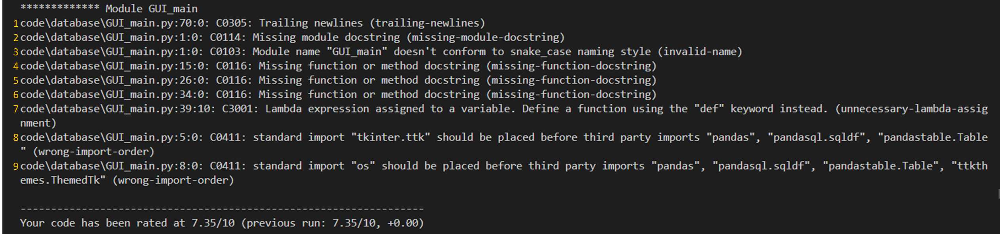

## First Fixes

The problems are numbered  (orange integers) in the screenshot above.

### 1 trailing newlines

Old code: Empty lines at the end of the file  
 

Fixed code: removed empty lines, lkast line is now last line of code

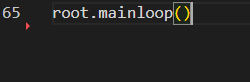

### 2 missing module docstring

Old code: line 1 is not a module description

Fixed code: line 1 is now a desciption of the module

### 3 module name "GUI_main.py" doesn't conform to snake_case naming confention

We renamend GUI_main.py to gui.py

### 4 missing function or method doscstring

Old code: 

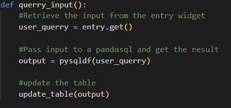

Fixed code: 

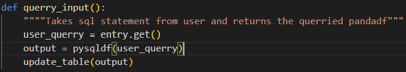

### 5 missing function or method doscstring

Old code: 

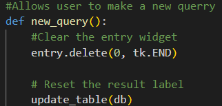

Fixed code: 

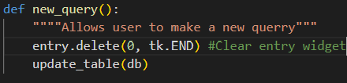

### 6 missing function or method doscstring

Old code: 

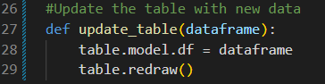

Fixed code: 

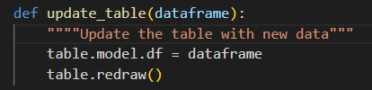

### 7 unnecessary-lambda-assignment

Old code: 

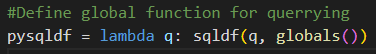

Fixed code: 

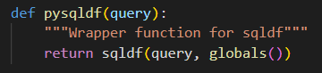

### 8 Wrong import order

Old code: 

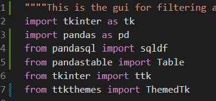

Fixed code: 

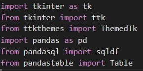

### 9 Wrong import order

We can discared this change, because we noticed we don't  need the os library.

## Second fixes

We reruned pylint and this was the reslust:

### 1 Final new line missing

Old code:

Fixed code:

### Third fixes

