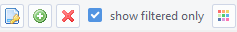
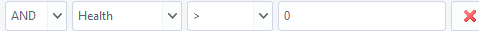

# Evolution Simulation Project

Welcome to the Evolution Simulation project!

Our goal is to simulate the evolution of virtual organisms using neural networks within a dynamic environment. Our main vision is to maintain procedural simulation, avoiding the implementation of predefined animal types. This approach allows evolutionary selection to unfold freely, potentially surprising us with its results.

The goal is to continually make the simulation more complex by adding new features from real life to enable vast amount of different adaptations to the simulations settings.

Below, you'll find information on how to set up and run the simulation, as well as an overview of its features.

## Features

- Animals consuming food and utilizing energy to survive.
- Reproduction based on accumulated energy.
- DNA system defining various aspects of an animal (work in progress).
- Organism Database to filter and query (work in progress)
- Visualization of gene distribution in the simulation (work in progress).
- User-friendly GUI for simulation settings adjustment (work in progress).

## Usage

This project can be used to try out different simulation conditions and settings which can be analysed later on. 

### Simulation

To run the simulation you need to run the [main.py](code/simulation/main.py) file.

From there currently the `Database` button is currently not implemented as we are working on merging the two parts of the project into one GUI. However by pressing `Simulation` the user gets into the world where he can toggle `paused` to enable the simulation running (also works with `spacebar`.

In the `Options` menu the user can toggle wheter he wants to save the organisms, animals, plants to the database. (Note that `Create database` needs to be toggled for `Save "Animals / Plants" to database` to work). The `Screen` menu is not yet implemented and acts as a placeholder.

In the topright is the toolbar wich has the following features:
- `i` show information about an organism when pressing on the tile
- `A` spawning animals
- `P` spawning plants
- `KA` killing animals
- `KP` killing plants

The user can find many more settings and options by traversing the menu on the right side.

-`World` for editing the world defining functions and randomising their values.
  - `Height` for scaling the general height of the world.
  - `Moisture` for scaling the general moisture of the world.
  - `Scale` for zooming in and out of the world (Note: does not change the animal / plant size).
  - `Randomise Everything` to randomise all function values.

-`Spawning` for spawning entities without the mouse
  - `Num. Animals: ` enter a number of animals that should be spawned and press enter.
  - `Num. PLants: ` enter a number of plants that should be spawned and press enter.

The following submenus are currently under construction and not completely properly structured but feel free to check them out and play around.

-`Entities`

-`DNA`

### Database
To access, filter and query the database, you need to run the [gui.py](code/database/gui.py) file.

To sort data in ascending/descending order in a column, right-click on the column and choose `Sort by "column name"` followed by an arrow.

You can also apply a function (e.g. calculate the mean of a column with numerical data) by right-clicking on a column and choosing `Apply function`.
A little window pops up and you can choose between various functions, choose if the column will be updated by the values or a column will be created with a given name.

To filter data to your liking, click on a row, right-click and choose `Filter Rows`.

Either you can use String Queries or by clicking on the green plus symbol, you can define a custom filter where you can specify the column, the condition and the comparison value:

It is also possible to add more filters by clickinig on the green plus symbol.

To apply filters, check the box `show filtered only` and click on the key symbol.

To delete filters, click on the red cross symbol.

## Contributing

If you'd like to contribute to the project, please follow these steps:

1. Fork the repository.
2. Create a new branch (`git checkout -b feature/new-feature`).
3. Make your changes.
4. Commit your changes (`git commit -am 'Add new feature'`).
5. Push to the branch (`git push origin feature/new-feature`).
6. Create a new pull request.

## Credits

This project was initiated by Jeremy Moser.

Later on it was worked on as a project for a lecture Programmig for Data Science by Jeremy Moser, Andrin Müller, Dimoth Pathiniwasam and Milos Kecman.

Inspirations for the project were other projects like [the Bibites](https://www.youtube.com/@TheBibitesDigitalLife), [Coding Train](https://github.com/CodingTrain), [Sebastian Lague](https://github.com/SebLague), [LifeEngine](https://github.com/MaxRobinsonTheGreat/LifeEngine) and many more.

## License

This project is licensed under the MPL-2.0 License. See the [LICENSE](LICENSE) file for details.
